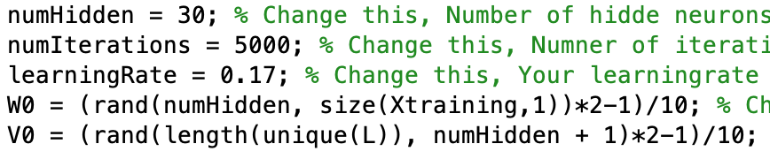
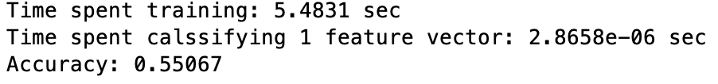

```{r setup, include=FALSE}
knitr::opts_chunk$set(echo = TRUE)
```


Contributors : Mim Kemal Tekin( mimte666) & Andreas Stasinakis( andst745)


\newpage

#NN - Report 1 :Supervised

## Question 1 Data overview
 
*1.	Give an overview of the data from a machine learning perspective. Consider if you need linear or non-linear classifiers etc.*

In this report we have to implement two different algorithms in order to classify 4 data sets. For all the dataset we have classification problem which means that the response variable can take some labels. More specific, the first two data set, the independent variable $X$ is 2D and the target variable can take only 2 values $1,2$. The 3rd dataset has also 2D predictors but 3 labels for the response variable. Finally, the last data set is the most complicated with 64 features and 10 different classes. We also plot all the 4 datasets and we comment about appropriate classifiers. 

{ width=400 }

For the first dataset, it is obvious that a linear classifier can do a really decent work. A linear classifier almost parallel to x -axis( or at least with low slope) and an intercept value close to -3. Of course, some of the data close to the linear boundaries may missclassified but it seems that the accuracy can be really high and a linear classifier can give good results. 

{ width=400 }
{ width=400 }

The second dataset 2,3 though, a linear classifier does not seem to be the best solution. The misclassification rate for every linear model will be really high. The only linear solution which can make accurate predictions for dataset 3 is if we are only interested in two of the three labels( the red and the blue one). Finally for the 4th dataset, it is impossible to make predictions with a linear model given that we have 64 features and 10 classes. 


## Question 2 Down sampling for 4th dataset

*Explain why the down sampling of the OCR data (done as pre-processing) result in a more robust feature representation.*
*See http://archive.ics.uci.edu/ml/datasets/Optical+Recognition+of+Handwritten+Digits.*

Down sampling is really useful when we want to make the data simpler. The first data was probably a photograph of handwritten digits. But this photos can be in different resolution, sizes and it is hard to interpret these data for computer. If we use some filtering, compression algorithms in order to reduce the dimensionality of this data we can get more standardized. If we visit the webpage of this dataset, we can see the author had 32x32 bitmaps of these handwritten digits and he divide those 4x4 blocks which are not overlapping. This operation reduce dimensions to 8x8 and in this way all bitmaps can present with 64 bits. This data is more processable for computer. Reducing dimensionality will reduce the calculation time and it will save more disk space.

##Question 3 Summary of KNN algorithm

*Give a short summery of how you implemented the kNN algorithm.*

In this task we implement the $KNN$ algorithm. We create a function which takes an an input 4 parameters(X = features to classify, k = number of neighbors, Xt = training features, LT = the correct labels) and gives as output the prediction labels. For each one of the observations we calculate the $\text{Euclidean Distance}$ with all the training data using the formula above :

$$\sqrt{\sum_{i = 1}^{\text{D}}(Xt_i-X_i)^2}$$, where $X_t$ = training data and $X$ are the observations.

After sorting the results, we create a  table (function tabulate) using only the first k elements of these results. Finally, the prediction for each observations is given with respect to the majority vote. More specific, in the stored table we have the number of data classified as, for example, 1 and -1. We sum them, and choose the biggest number so  this is stored as the predicted label. Therefore, if 10 are classified as -1 and 20 as 1, our prediction is the label 1.

## Question 4 Draw in KNN algorithm
 
*Explain how you handle draws in kNN, e.g. with two classes (k = 2)?*

In a draw case, there can be 2 possible solutions which are that returning no response, or selecting an answer randomly. If we do not have any requirement that says k should be only 2, we can decrement our k by one and we can eliminate draw state in order to give a correct answer. The thing that we do in this assignment, choosing the first index of nearest 2 observation. For example if we have distance vector for an input like [12, 12, 15, 16, ...] and the labels like [A, B, A, A, ...]; next step will be counting the labels respect to k=2 so the counts will be like this [1, 1] and [A, B]; in this case we choose the first index which has A label. 

## Question 5 Choice of optimal K in KNN.

*Explain how you selected the best k for each dataset using cross validation. Include the accuracy and images of your results for each dataset.*

The cross validation function takes X, D, L variables in order to split the data with the pre-created selectTrainingSamples function. Additionally it takes Nfolds and k variables. Nfolds is the fold count of k-fold cross validation algorithm and k is the k parameter of KNN algorithm. First of all we divide the data into cells in order to create folds. After this we start an iterations for each fold and we pick each fold as test data and rest of folds are train data. In every iteration we calculate the accuracy rate and store this value in a array. After the loop is ended, we calculate the mean of accuracy rate and we return this mean.  
We run the cross validation function for the values of $k=1,4,7,...40$ and the screenshots of all datasets are below. For all plots, Blue Lines: test with test data; Red Lines: test with train data. We test with train data also in order to being aware of overfitting fact.

### Dataset 1

\begin{center}
{ width=400 }
\end{center}

Expected Accuracy =  98%

$k_\text{opt} = 10$  
$\text{Acc} = 0.99$

In this plot we can see we get the first highest accuracy with the test data (blue line) appears at $k=22$. Also fitting to training data is good, so we can select this value. But $k=22$ is a high value and it is costly to calculate, we can reduce this value in order to create a simpler model. We can use $k=10$ which has really good result and it is still higher than expected accuracy.

### Dataset 2

{ width=400 }

Expected Accuracy =  0.99  
$k_\text{opt} = 4$  
$\text{Acc} = 0.995$

In this plot, the first highest accuracy with the test data at $k=1$, but when we take $k=1$ the model is overfitting to training data, we can see this effect from the red line (the accuracy is 1 on test with training data). It is better to take $k=4$ or $k=7$ in order to avoid overfitting and these k values still gives same highest accuracy on test data. Also expected accuracy limit is satisfied.

### Dataset 3

{ width=400 }

Expected Accuracy =  0.99  
$k_\text{opt} = 3$  
$\text{Acc} = 1.0$

In this plot we can see a decrease trend for both of the test with train and test data. Highest accuracy rates are at $k=3, 6 \ \text{and} \ 9$. But at 6 we have overfit again. One of these values can be selected as optimal k.

### Dataset 4

{ width=400 }

Expected Accuracy =  0.96  
$k_\text{opt} = 1$  
$\text{Acc} = 0.982$

In this model we get optimal k value at $k=1$ with a accuracy between 98% - 98.5% with a really overfitted training data (we can observe it from red line). Our accuracy expectation is 96%, we are above of this limit. This means we can reduce this overfitting effect by choosing a value between 3,6 or 9; our accuracy will still above than 97.5%.

## Question 6 Sumarry of Backprop network implementations.

*Give a short summary of your backprop network implementations (single + multi). You do not need to derive the update rules.*

The second part of the report was to train two Neural network and implement back propagation in order to optimize the weights. For the single layer, we train the neural network and we predict the target values $Y$ which are just a linear combination of the weights and training data. We start with random weights, values between -0.1 and 0.1, and our target is to find the optimal values. Optimal values in this case are the weights which minimize the misclassification error ($\frac{\sum_{i=1}^{N}(\text{Predictions - Real values})^2}{N}$). So we compute the gradient for the weights from the formula below( in a matrix form):

$$2((Y - D_t)X_t^T)/N_t$$, where $Y : \text{predicted values}, D_t = \text{True values}, X_t = \text{training data}, Nt = \text{number of observations}$. 

Moreover, we multiply this gradient with a learning rate and  we  subtract it from the "old" weights. The specific formula used is :

$$W_{t+1} = W_t - \text{learning rate}*\text{gradient}$$

Finally, we run this algorithm for a number of iterations as a result in every iteration the weights reach the optimal values. 

The procedure for the multilayer implementation has the same structure. Firstly we train the neural network using random weights. In this case we have also one hidden layer so we have to consider of two weights matrices( $W,V$). While we are training the neural network, we compute the $S$( unit of the hidden layer) matrix which is the linear combination of the weights and the input signals. After that we use an activation function( tanh function) which will give us values between (-1,1) and we use these values (matrix $U$) in order to calculate the output $Y$. The output $Y$,as before, is a linear combination of the weights $V$ and the $U$ values. Finally, we calculate the error for each observation and obviously our target is to minimize this error as we did in the single layer.

After we trained the model, it is time to compute the gradients as before. It is clear that now we have to calculate two different gradients, one for $W$ and one for $V$. After some calculations using the chain rule we came up with the following formulas :

For the $V$ gradient : $$2((Y - D)U^T)/N$$

For the $W$ gradient :$$2*((V^*)^T(Y-D).*(1 - (U^*)^2)*X_t^T)/N$$

,where $Y = \text{predictions}$, $D = \text{real labels}$, $N = \text{number of observations}$, $V^* = \text{V without the bias}$, $U^* = \text{U without the bias}$, $X_t = \text{training data}$. 

We run this procedure for many iterations and in each iteration we calculate the new weights until we estimate an optimal solutions. For both implementations we have to be careful for the number of iterations and the values of the parameters( such as the learning rate) which will be discussed below.

## Question 7 Interpret results of Backprop.

*7.	Present the results from the backprop training and how you reached the accuracy criteria for each dataset. Motivate your choice of network for each dataset. Explain how you selected good values for the learning rate, iterations and number of hidden neurons. Include images of your best result for each dataset, including parameters etc.*


The choice of the parameters and the number of iterations we run the algorithm is really crucial. For example, for a big number of iterations we may have overfitting or if we choose the wrong learning rate we may never find the optimal weights. There is not any specific rule in order to choose  the best combination for these values. For that reason, we try different combinations and we present the optimal results below. We also have to mention that after some iterations or number of units the result may not change, so our choice is also concern about the computational complexity.

### Dataset 1


{ width=400 }
{ width=400 }
{ width=400 }

As mentioned before the first data set is linear separable, so we do not need a really complex neural network. As can be seen from the pictures below, We train a model with only 5 units in the hidden layer, learning rate 0.01 and we run it for 5500 iterations. The accuracy we obtain for this values is 99.3%.

We try for different number of units but in the end we obtain the same results for 5,7  and 8 units of the hidden layer as a result we chose the less complex. For the learning rate we try a high value( 0.1), a small one(0.001) and one between them (0.01, which was the optimal one). Moreover, the results between those numbers were not that important but we choose the most logical. Finally for the number of iterations, we run for many different values but after 5500 the results was the same so again we choose the less complex.

### Dataset 2

{ width=400 }
{ width=400 }
{ width=400 }

For the second dataset, We train the model with  5 units in the hidden layer, learning rate 0.01 and we run it for 2000 iterations. The accuracy we obtain for this values is 99.8%.

This dataset have really clear boundaries. More specific, the distance between the two classes is quite big. For that reason we can take similar results for many different combinations. Therefore, we chose the less computational heavy. One thing we have to mention here is that while we increasing the number of iterations, the boundaries are changing and after a number of iterations the accuracy is decreasing.  

###Dataset 3

{ width=400 }
{ width=400 }
{ width=400 }

The third dataset is more complex and it also has 3 classes. We train the model with  20 units in the hidden layer, learning rate 0.01 and we run it for 8500 iterations. The accuracy we obtain for this values is 99.399%.

We choose 20 units because a smaller number could not handle all the features and the 3 classes. Each unit is a linear combination of the input and it is like a characteristic which is used in the prediction procedure. So for this dataset we could not obtain the 99% limit for less units. The complexity of the dataset increases also the number of iterations we have to run the algorithm.

### Dataset 4

{ width=400 }
{ width=400 }
{ width=400 }

Finally, the last dataset is the most complicated. It is really difficult to obtain accurate results with only one hidden layer and that is the reason we train it with 32 units. Moreover we run the algorithm for 3500 and we obtain the optimal 96.318. The number of iterations is not that high but the 32 units make the algorithm computational heavy. 

We should also mention that in both implementations( single and multi layer) we derive the initial weights by 10 in order to take small values between -0.1 and 0.1. This is the reason why in all four datasets the learning rate is 0.01, which seems quite high for some cases. Moreover, the datasets, especially the first 3, are not that complex and this is the reason why small changes of the parameters or number of iterations do not change the output significantly.

## Question 8 Non - generalizable backprop

*Present the results, including images, of your example of a non-generalizable backprop solution. Explain why this example is non-generalizable.*

In this task we have to implement an non generalizable model. In general, when we fit a model we care about the generalization error. That means that it does not matter that much if the error is small for the training data, if the error for new unseen data is high. A model which makes accurate predictions for the training data but not that accurate for unseen data called *Non generalizable*. 

In order to implement this model, we split the data in a different way from the tasks above. We wanted to exclude any randomness so we choose specific columns of the data without shuffling. More specific, we choose as training data the 500 first observations and the rest as test data. We try to optimize our accuracy, using 30 units to the hidden layer, 0.17 as learning rate and we run the algorithm for 5000 iterations. As can be seen to the plot below, this choice make the accuracy of the model to decrease because it is overfitting in the training data and make inaccurate predictions in a new unseen data set.    

{ width=400 }
{ width=400 }
{ width=400 }
{ width=400 }

More specific, while the neural network classifies almost all the training data correctly, the accuracy for the test data is poor (only 0.55067 ). This means that the model is not generalized, so it gives inaccurate predictions for new unseen data. One explanation for this can be that the training set is a small sample of the sample space, so it can not  reflect the characteristics of the sample space. In this specific case, we can see from the plots that the model is trained without any observations for the 3rd class, so the prediction's boundary are created between class 1 and 2 only. Therefore, when we try to predict an observations which should be classified as class 3 , the neural network classifies to the first or to the second class and the in this way the accuracy reduces.  

## Question 9 Conclusions 

*Give a final discussion and conclusion where you explain the differences between the performances of the different classifiers. Pros and cons etc.*

In this assignment, we used K-Nearest Neighbor, Single Layer Neural Networks and Multilayer Neural Networks. We can say KNN has really nice results for all datasets if we see the results of question 5. KNN is really handful because it can give good results in a really short time, in contrast to neural network models that we have done. But the bad thing about KNN, it stores all the data to make a prediction and it has to discover the data in every prediction. In other words we can say it is a method of Lazy Learning, it does not create a statistical model like neural networks. But neural networks has a training process and it takes the training data as an input and it calculates optimum weights with gradient search. This resulting weights are the model that we will use for predictions and this model provides us fast predictions by just applying the forward algorithm. The training of neural networks may take really long time because of back-propagation part, but it saves us to store data. There is another benefit of KNN, we can update this model easily, thanks to not having a training part. We can simply add the observation(s) to the current dataset and in the next prediction this data will affect the result if it is inside the first kth nearest observations to the input. But if we want to update the neural network somehow we should train it again and this will be really big problem for a complex models and big datasets. If we talk about single layer an multilayer neural networks, we can obviously see multilayer neural networks have much more accuracy than the single layers. Addition to all KNN is much more understandable model than neural networks. KNN can be really competitive for neural networks if we have a problem such as not suitable to separate linearly. For example we are not able to separate 2nd, 3rd and 4th linearly and we can see KNN can classify the test data with high accuracy in really short time. But neural network should train itself first and it takes time more than KNN. If we think about we have same accuracy with both KNN and NN, NN may be faster such a case if the count of observations to classify is to high. But for a fast solution KNN will have the advantage because it is easy to implement and fast to get a classification.

## Question 10 Improvements of two algorithms.

*Do you think there is something that can improve the results? Pre-processing, algorithm-wise etc.*

For most of the cases above our results are accurate enough. That does not mean though that we can not improve them. Most of the times, especially in real world problems, the data we have to handle are incomplete. In other words they may contain missing values, errors, outliars or discrepancies in variables. For that reason it is more than *necessary* to implement a procedure called *Data Pre Processing*. In this way we can handle all that problems and make our data more flexible to work with and of course in the end make more accurate predictions. In this specific case, except maybe for the 4th dataset, this procedure will not make such a difference but it is something which should be always help us in any machine learning problem.

There is one thing we can change to the K-Nearest Neighbor algorithm. If we have a draw in the distances, instead of choosing the label randomly, we can create an algorithm for that. More specific, if a draw is occur, we can change the  number of neighbors from $K$ to $K-1$ for this specific observation and choose using the majority vote. This may seem computational heavy but it can improve our accuracy especially if we have many draws in our distances. 

As far as the Neural network concern, we can improve the accuracy for the last dataset increasing the number of hidden layers. A recognition of handwritten digits is a really complicated problem and many of the characteristics of an image should be captured. For that reason, we can use 2 hidden layers, reconsider the parameters and we will probably have more accurate predictions.


