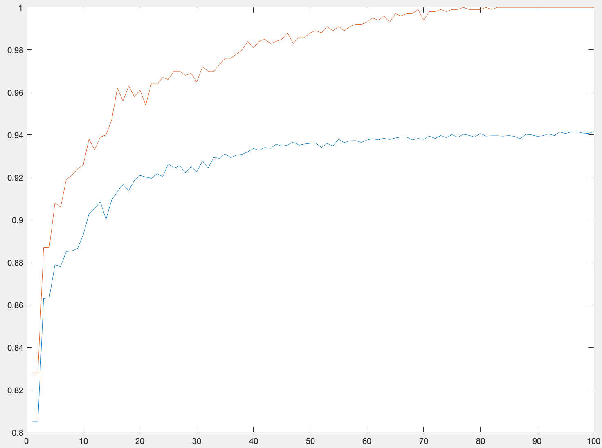
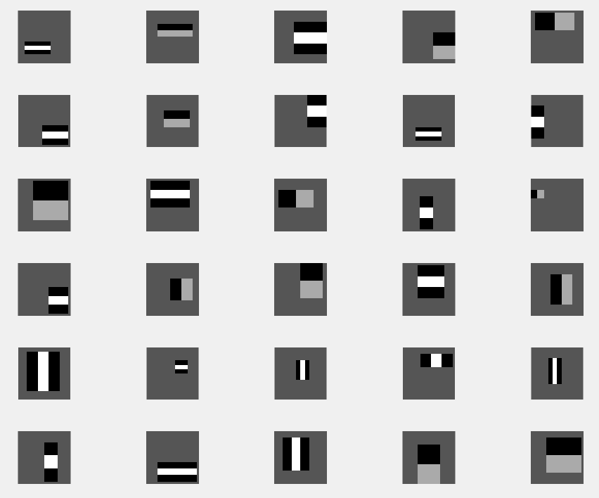
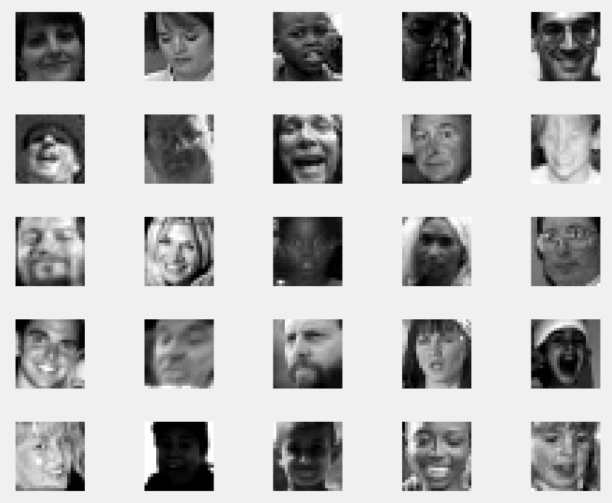
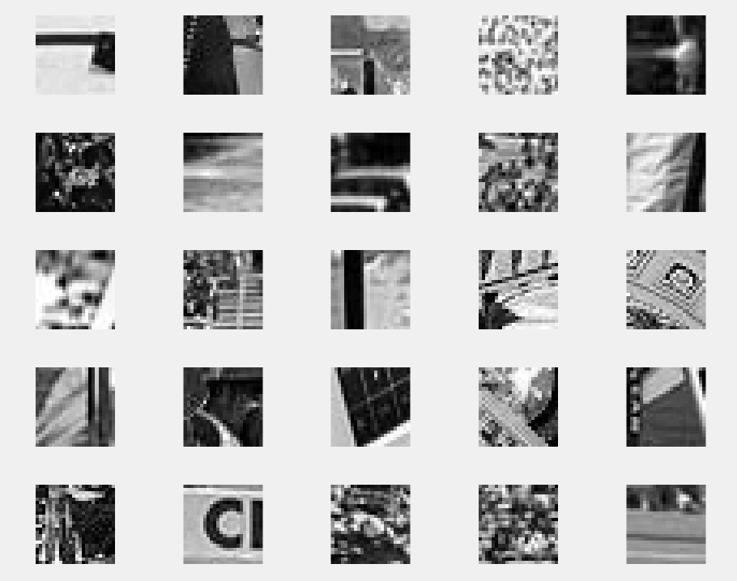

```{r setup, include=FALSE}
knitr::opts_chunk$set(echo = TRUE)
```

Contributors : Mim Kemal Tekin(mimte666) $ Andreas Stasinakis(andst745)
\newpage

*In order to pass the assignment you will need to answer the following questions and upload the document to LISAM. You will also need to upload all code in .m-file format. We will correct the reports continuously so feel free to send them as soon as possible. If you meet the deadline you will have the lab part of the course reported in LADOK together with the exam. If not, you'll get the lab part reported during the re-exam period.*

# Report 2: Boosting

## Question 1: Plot Accuracy vs Weak classifiers.

In this report we have to implement an adaboost algorithm in order to classify images with faces and non - faces. 


*Plot how the classification accuracy on training data and test data depend on the number of weak classifiers (in the same plot). Be sure to include the number of training data (non-faces + faces), test-data (non-faces + faces), and the number of Haar-Features. *

{ width=340 }

We train the model for many different number of weak classifiers, features and training  images. We only present the best results and not all of them. Therefore, we train the model using 100 weak classifiers, 1000 training data(500 faces and 500 non faces), 11788(4416 faces 7372 non faces) test data and 100 features. We can make really good conclusions from the plot. First of all the algorithm seems to work correctly. The training accuracy(red line) is always more than the test accuracy(blue line) and while the number of classifiers increases, the model overfitting the data. This is logical because, we only use almost 10% of our total data and we use many weak classifiers for a quite small amount of data. Of course we do not care that much for the training accuracy, but for the test one, which seems to reach a peak close to 94.15%. It is also true that after 40 weak classifiers the accuracy odes not change that much. We also comment to the number of weak classifiers we actually need for the strong classifier in the task below. One can say that we can use more training data in order to avoid overfitting which seems correct. We decided though not to do that because, despite the fact that the model is overfiting to the training data, the generalized accuracy is really high.   

## Question 2: Comments for the Number of weak classifiers.

*How many weak classifiers did you use when training? How many of them did you use for the final strong classifier? Why?*

As mentioned before, we train the model using 100 weak classifiers. From the plot above though, we can observe that the accuracy of the test data increases significantly until close to 40. After that the accuracy does not change that much for the rest numbers of weak classifiers. That means that we will have almost the same results if we choose 40 weak classifiers instead of 100 for the strong classifiers. This is something useful because we make our model less computational complex.  So from now on for the strong classifier we only use 40 weak classifiers.

## Question 3: Accuracy of the strong classifier.

*3.	What is the accuracy on the test data after applying the optimized strong classifier?*


Finally, we apply the strong classifier on the test data. The optimized strong classifier consists of 40 weak classifiers and 30 Haar features. The accuracy we obtained using these parameters is 93.36% which is more than the 90% we are searching for. Someone can say that we can achieve an accuracy more than 94% as mentioned before using more weak classifiers.  Here we should say that the optimal accuracy 94.15% is obtained using close to 100 weak classifiers. So in the end we decide that it is not worth to make our model much more complex in order to increase the accuracy for only some decimals.  

## Question 4: Plot Haar -features selected. 

*4.	Plot the Haar-features selected by your classifier (one for each weak classifier). If you have many weak classifiers, select some representative subset.*

{ width=340 }

In our strong classifiers we have 40 weak classifiers which we have selected. And some of Haar-features are the optimal feature for more than 1 classifier. When we get the unique subset of these features we have only 30 Haar-features. Above we can see all these Haar-features.


##Question 5: Plot misclassified faces, non-faces and reasons why.

*5.	Plot some of the misclassified faces and non-faces that seem hard to classify correctly. Why do you think they are difficult to classify?*


{ width=340 }


{ width=340 }

In the first figure we can see some misclassified images as non-face which contain faces in reality. We can realize that many of them are dark or light photos which can affect the algorithm bad. When we use the created filters on this dark and light pictures they will probably give too high or low results. And probably the filters cannot capture any identifier shape for a human face. There are some blurred or low resolution pictures also, blur causes similar pixel values in neighbor pixels and it makes harder to capture identifier shapes again. Another common thing is closed eyes in the misclassified pictures.  
In the second figure we can see some misclassified images as face which contain no faces in reality. Most of them has patterns inside it, which can be misleading for some filters. We have 30 filters which are visible in Question 4 and we can see we have some too small filters. Patterns can contain some similar information which are close to eyes, nose, ... when these small filters are used. 


## Question 6: Defend the results obtained.

*6.	Defend your results. Are they reasonable?*

After analyzing the results we obtain, changing the parameters and testing it in unseen data, we can say that the algorithm does a really decent job. Our accuracy is more than 93% for most of the cases and if we do not care that much about the complexity of the algorithm we can improve that result and reach maybe more than 95%. We should say here that we train the model only using the 10% of your total data which means that the model is generalized really efficient. This is very important because in general this is the our target. We need to train a model which has a low generalized error or high generalized accuracy. So in this case we achieve this goal. As mentioned before, some of the faces and non faces misclassified but this normal for a problem like face recognition. In conclusion, our results are reasonable, accurate and we train the model not only with respect to the accuracy but also to the computational complexity.

##Question 7: Conclusions.

*7.	Can we expect perfect results? Motivate your answer.*

Image detection is a hard task because there are many parameters that should be evaluated. In this task the results we obtained are accurate enough. It is really hard, probably impossible, to expect perfect results. One reason can be that for a 24X24 image we have close to 160,000  possible features we should care about. Of course, it is not possible to use all of those in order to train the model. It would be impractical and computational expensive. So we have to choose a subset which capture the details we want the most. As mentioned before, in this task we use only 30 features. Therefore, it is possible, some of the characteristic of an not that clear face not be capture as a result this image  misclassified. Of course our result depends also on the dataset we have but in general any model can not predict 100% accurate, especially in such a tough problem. 


